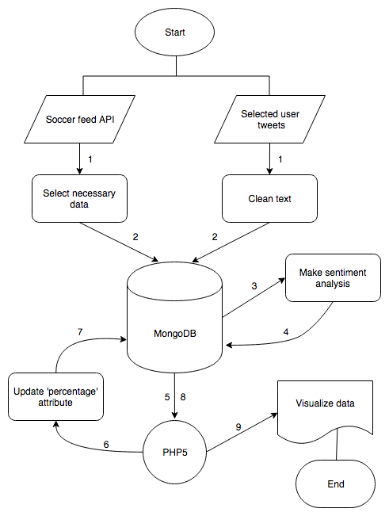

# LigaMX Forecaster
Final project for TC3041 - Advanced Databases, where I try to forecast the winner of Liga MX championship by using a soccer feed and analyzing sport experts tweets.

## Author
Juan Carlos Sanchez Cruz - A01631462

## Motivation
This project seeks to solve a simple question, who will be the winning the liga mx season 2018? In Mexico football is almost treated with political language and it is no coincidence that there are so many sports analysis programs. This sport is a round-the-media business. The live broadcasts of the matches are very expensive due to the number of people summoned. After every football game, the conversation turns to interpret the events and plays. But one of the things that draws my attention is the speculation that is created before, and that the Mexican League is very difficult to predict. Bets never fully favor one side, and there are many factors that can affect a team's performance.

What I'm looking for in this project is to make a prediction that uses historical data about the teams in the playoff and complement it with the positive or negative opinions on tweets of a selected group of sports analysts.

## System Architecture
The data flows in the system as follows:  

The numbers correspond to the chronological order in which the processes are developed. In the case of the two sources of data mining, this could be done in parallel.

## Data Mining
There are two main sources for the data needed.

### Soccer Feed
After looking for many sports feed that could give me the information needed in a JSON, I found [Fantasy Data](https://developer.fantasydata.com/) which is RESTful web API that provides updated historical data for free.

It took me 3 steps to gather the information.
1. To search the roundId so I can query the right information from the API.
2. Pull a JSON from the API that has relevant information of the teams from the league.
3. Insert information to the database including the follow attributes:  
    - Table position
    - Games played, wins, lost, and draws.
    - Goals in favor and against.
    - Last games streak.

### Sport Experts Tweets
To mine the data on Twitter, I used the Python library [Tweepy](http://www.tweepy.org/) which allows you to pull up to 200 tweets per user.  
The information extracted was:
- The tweet id
- The creation date
- Username
- The full tweet text

As each tweet was pulled before it gets a JSON format, the full_text attribute is cleaned, by removing unnecessary jump spaces and by replacing `" "` with `''` to avoid some format conflicts.

## Tangible Data
The combination of two types of data sources makes inference and prediction more robust. Our tangible data are nothing more than variables that serve to measure the success or failure of the football teams to examine.

### Validity
This data does belong to the same scheme of the search, since it is information that directly affects the objects that we examine.

### Accuracy
One of the main data that the betting houses use to calculate the probability of victory or defeat of a sporting event are the historical statistics of the teams involved. This method is used in the algorithm of this program, with the singularity that the opinions of expert analysts are also taken into account.

### Completeness
The necessary data will never be sufficient since there are other factors that, as small as they may be, can completely alter the outcome of a football match. However, the approach that is being given to the information used is, to some extent, good in order to achieve a justified inference.

### Consistency
matches other data
### Uniformity
same units

## Database Used
MongoDB

## Data Visualization

## DIKW Pyramid

## Conclusions

## Constraints

## Future Improvements

## Run this Project

## Built With
- MongoDB
- PHP5
- Python 3.6
- Tweepy
- Bootstrap Material Design

## Acknowledgments
- To all sports analysts whose twitter accounts were used for this project.
- Rodolfo Rubén Alvarez, teacher of TC3041 course at ITESM.
